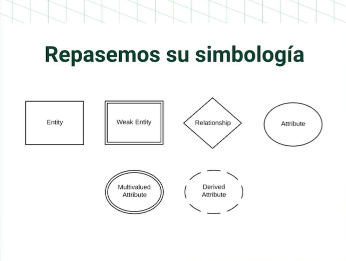
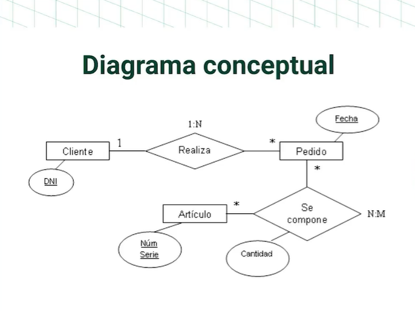
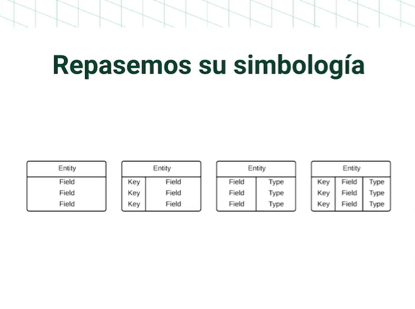
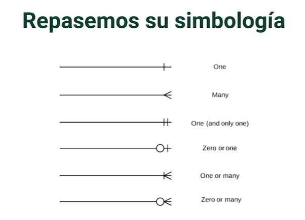
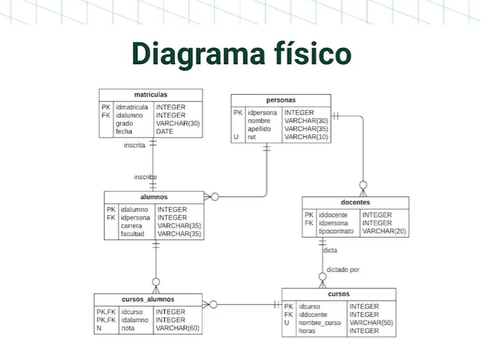
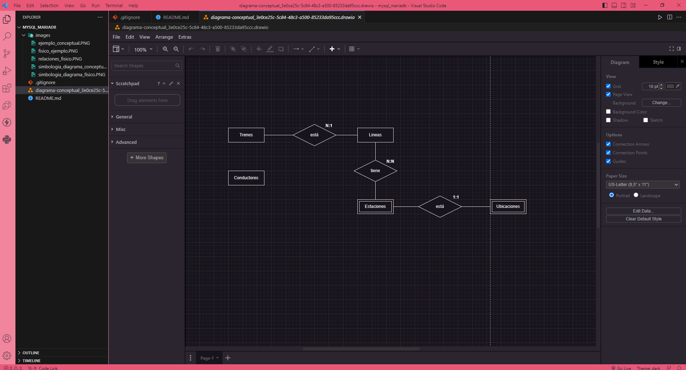

# Bases de datos con MySQL y MariaDB

MariaDB es MySQL pero 100% libre y gratuito y con promesa de seguir siendolo así por siempre. MySQL aún es gratis pero es un producto de Oracle en la actualidad. 
Ambos motores de bases de datos fueron construidos por Michael Widenius (Alias Monty).

-----------------

## Diagramas de relaciones conceptuales vs Diagramas de relaciones físicos

El **Diagrama Entidad Relación** se divide en dos tipos:

1. **Diagrama Conceptual**: Nos permite tener una visión general de lo que se quiere construir de una manera no detallada, por ejemplo, la relación de una entidad con otras entidades.

Simbología: 

Veamos un ejemplo:

2. **Diagrama Físico**: Es un diagrama más detallado, incluye relaciones, tipo de relaciones, tablas, columnas, tipos de datos, entre otros. Nos permite tener en detalle toda la descripción de la base de datos.

Simbología:

Así es como expresamos relaciones en un diagrama físico: 

Veamos un ejemplo entonces de un diagrama físico: 

**¿Donde podemos armar nuestros diagramas?**

https://www.drawio.com/

También existe un plugin para VSC que nos permite armar nuestros diagramas directamente en nuestro editor con archivos ".drawio"

Se ve algo así: 

**¿Donde podemos encontrar mas detalles sombre la simbología de nuestros diagramas entidad-relación?**

https://www.lucidchart.com/pages/es/simbolos-de-diagramas-entidad-relacion

El Diagrama Entidad Relación tambien es conocido como:

1. Diagrama ER
2. Diagrama E-R
3. ERD.

